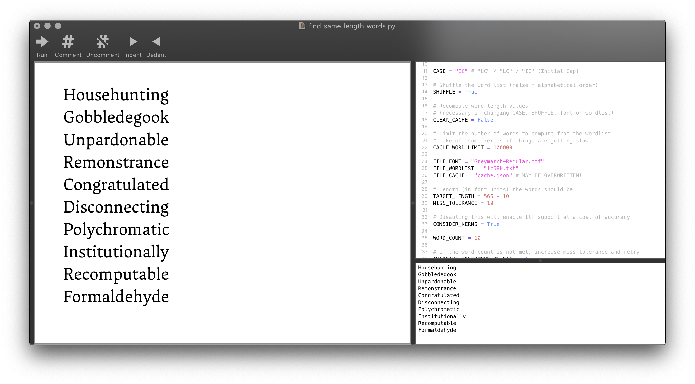

# Find Same Length Words
Calculates words with similar or identical advance widths for a given font.

## Usage
Change the variables at the top of `find_same_length_words.py` until you feel a sense of joy. `FILE_FONT` should be an OTF, which might need to be in the same directory as the script. I haven't taken all the naughty words out of the `lc58k` wordlist, you might want to use your own or edit it.

You can run this as a CLI script, but it's written with [DrawBot](https://www.drawbot.com) in mind.

## Cache
Calculating the advance widths of 58,000 words is somewhat computationally expensive, so the script makes use of a cache. When you first run the script, `cache.json` is created to store the pre-computed advance widths of all the words in a random order. If you change the font, you'll need to enable the `CLEAR_CACHE` flag at the top of the main script the first time you run it (or just delete `cache.json`).